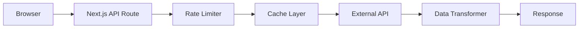

# Finance Factors Dashboard

A comprehensive Next.js 15 dashboard application for visualizing real-time financial and economic data with interactive Chart.js visualizations, featuring live API integration, intelligent data source management, and automatic deployment.

## 🌟 Key Features

- **🔴 Live Government APIs**: Real-time data from FRED, BLS, Census Bureau, Alpha Vantage
- **📊 Interactive Charts**: Dynamic visualizations with Chart.js 4.5.0 and react-chartjs-2 5.2.0
- **🔄 Smart Data Switching**: Automatic fallback between live APIs and historical data with intelligent retry logic
- **⚡ Performance Optimized**: Lazy loading, code splitting, intelligent caching with Redis and TTL
- **🚀 Automatic Deployment**: GitHub Actions → Vercel with preview deployments and health checks
- **📱 Responsive Design**: Optimized for all devices with CSS Modules and responsive layouts
- **♿ Accessibility**: Full keyboard navigation, screen reader support, and WCAG 2.1 AA compliance
- **🛡️ CORS-Free**: Next.js API proxy eliminates cross-origin issues with rate limiting
- **📈 Real-time Status**: Live API health monitoring, data freshness indicators, and error boundaries
- **🎛️ Context-Driven State**: React Context API with DashboardProvider, AutomaticDataSourceProvider, and ViewModeProvider
- **🔧 TypeScript Strict**: Full type safety with comprehensive interfaces and strict mode enabled

## 🌐 Live Demo & Status

**🌐 [View Live Dashboard](https://finance-factors.vercel.app/)**

### Current Deployment Status
- ✅ **Production**: https://finance-factors.vercel.app
- ✅ **API Health**: https://finance-factors.vercel.app/api/proxy/health
- ✅ **Auto-Deploy**: GitHub Actions → Vercel (active)
- ✅ **Preview Deployments**: Automatic for pull requests
- ✅ **API Services**: FRED ✅ | BLS ✅ | Census ✅ | Alpha Vantage ⚠️

## 🚀 Quick Start

```bash
# Clone and install
git clone https://github.com/BurntFrost/finance-factors.git
cd finance-factors/next-dashboard
npm install

# Start development server
npm run dev

# Open http://localhost:3000
```

### Prerequisites

- **Node.js 18+** (Node.js 20+ recommended for optimal performance)
- **Package Manager**: npm, yarn, or pnpm
- **Modern Browser**: Chrome 90+, Firefox 88+, Safari 14+, Edge 90+

### Available Scripts

| Script | Description | Use Case |
|--------|-------------|----------|
| `npm run dev` | Start development server with Turbopack | Local development |
| `npm run build` | Build for production | Standard production build |
| `npm run build:analyze` | Build with bundle analysis | Performance optimization |
| `npm run start` | Start production server | Production server deployment |
| `npm run lint` | Run ESLint | Code quality checks |
| `npm run test:apis` | Test API connectivity | API troubleshooting |
| `npm run deploy` | Show deployment status | Check GitHub Actions deployment |
| `npm run deploy:manual` | Manual Vercel deployment | Emergency deployment |

## 📊 Available Data Sources

| Data Type | Source | Description | Frequency | Status |
|-----------|--------|-------------|-----------|---------|
| House Prices | FRED API | Case-Shiller Home Price Index | Monthly | ✅ Active |
| Employment | BLS API | Wages, unemployment rates | Monthly | ✅ Active |
| Economic Indicators | FRED API | GDP, interest rates, inflation | Monthly/Quarterly | ✅ Active |
| Demographics | Census Bureau | Population, income statistics | Annual | ✅ Active |
| Additional Indicators | Alpha Vantage | Stock data, forex | Daily | ⚠️ Optional |

## 🛠 Technology Stack

### Frontend Architecture
- **Framework**: Next.js 15.4.2 with App Router and React 18.2.0
- **Language**: TypeScript with strict mode and comprehensive type definitions
- **Visualization**: Chart.js 4.5.0 with react-chartjs-2 5.2.0 for interactive charts
- **Styling**: CSS Modules with responsive design and CSS custom properties
- **State Management**: React Context API with three main providers:
  - `DashboardProvider` - Dashboard element management and layout
  - `AutomaticDataSourceProvider` - Intelligent data source switching
  - `ViewModeProvider` - Edit/Live/Preview mode management
- **Performance**: Lazy loading, code splitting, Suspense boundaries, and dynamic imports

### Backend/API Architecture
- **Serverless**: Vercel Functions with Node.js runtime
- **API Proxy**: Next.js API routes for CORS resolution and security
- **Caching**: Multi-layer caching with Redis and in-memory TTL (30-minute default)
- **Rate Limiting**: Built-in rate limiting for external API calls
- **Data Sources**: Government APIs (FRED, BLS, Census Bureau, Alpha Vantage)
- **Error Handling**: Comprehensive error boundaries and fallback mechanisms
- **Data Transformation**: Standardized data transformers for Chart.js compatibility

### Development & Quality Tools
- **Build Tool**: Next.js with Turbopack for fast development builds
- **Linting**: ESLint with Next.js and TypeScript configurations
- **Type Checking**: TypeScript compiler with strict mode and path mapping
- **Testing**: Comprehensive API connectivity tests and health checks
- **Deployment**: GitHub Actions CI/CD → Vercel with automated preview deployments
- **Monitoring**: Built-in health check endpoints and performance metrics
- **Bundle Analysis**: Webpack bundle analyzer for performance optimization

## 🏗 System Architecture

### Architecture Overview

The Finance Factors Dashboard follows a modern React architecture with clear separation of concerns and intelligent data management.

```
┌─────────────────────────────────────────────────────────────┐
│                    Next.js 15 App Router                    │
├─────────────────────────────────────────────────────────────┤
│  Context Providers (Global State Management)               │
│  ├── DashboardProvider (Element management)                │
│  ├── AutomaticDataSourceProvider (Data source switching)   │
│  └── ViewModeProvider (Edit/Live mode toggle)              │
├─────────────────────────────────────────────────────────────┤
│  Component Layer                                            │
│  ├── AutomaticChart (Smart chart with data source aware)   │
│  ├── DynamicElementRenderer (Dynamic dashboard elements)   │
│  ├── DataStatusPill (Real-time status indicators)         │
│  └── UI Components (Dropdowns, toggles, controls)         │
├─────────────────────────────────────────────────────────────┤
│  Hooks Layer (Custom React Hooks)                          │
│  ├── useDataSource (Data fetching & caching)              │
│  ├── useDashboard (Dashboard state management)            │
│  └── useViewMode (Edit/Live mode state)                   │
├─────────────────────────────────────────────────────────────┤
│  Services Layer (Data & API Management)                    │
│  ├── realApiService (Live government APIs orchestrator)    │
│  ├── dataTransformers (Data format standardization)       │
│  ├── historicalDataGenerators (Sample data generation)    │
│  └── apiCache (Intelligent caching with TTL)              │
├─────────────────────────────────────────────────────────────┤
│  External APIs (Government Data Sources)                   │
│  ├── FRED API (Federal Reserve Economic Data)              │
│  ├── BLS API (Bureau of Labor Statistics)                  │
│  ├── Census Bureau API (Demographics & Housing)            │
│  └── Alpha Vantage API (Additional economic indicators)    │
└─────────────────────────────────────────────────────────────┘
```

### Data Flow Architecture

```
User Interaction
       ↓
Context Providers (State Management)
       ↓
Custom Hooks (useDataSource, useDashboard)
       ↓
Services Layer (API calls, caching, transformations)
       ↓
External APIs / Historical Data Generators
       ↓
Data Transformers (Standardize format)
       ↓
Chart.js Components (Visualization)
       ↓
User Interface (Interactive charts & controls)
```

## 📊 Modernized Chart System Architecture

The Finance Factors Dashboard features a **completely modernized chart system** with advanced interactive capabilities and unified architecture:

### 🚀 Key Improvements

- **Unified Chart Architecture**: All charts now use the enhanced `AutomaticChart` component with consistent behavior
- **Advanced Interactions**: Built-in zoom, pan, and crossfilter capabilities with intuitive controls
- **Performance Optimized**: Lazy loading, dynamic imports, and optimized Chart.js registration
- **Error Resilience**: Comprehensive error boundaries and recovery mechanisms
- **Accessibility First**: Full keyboard navigation and ARIA labels for all interactive elements

### 🎯 Interactive Features

- **🔍 Zoom & Pan**: Mouse wheel zoom and drag-to-pan with reset controls
- **🎛️ Interactive Controls**: Toggle zoom/pan modes with visual feedback
- **📊 Crossfilter Support**: Linked chart interactions for data exploration
- **💾 Export Capabilities**: CSV, PDF, and image export with customizable options
- **⚡ Real-time Updates**: Live data streaming with WebSocket support (configurable)

### 🏗️ Consolidated Components

| Component | Status | Purpose |
|-----------|--------|---------|
| `AutomaticChart` | ✅ **Primary** | Modern chart with all interactive features |
| `DynamicChart` | ✅ **Core Engine** | Chart.js rendering with interactive options |
| `OptimizedChartLoader` | ✅ **Performance** | Lazy loading and bundle optimization |
| `ChartRegistration` | ✅ **Setup** | Chart.js + zoom plugin registration |
| ~~`LazyChart`~~ | ❌ **Removed** | Superseded by AutomaticChart |
| ~~`RefreshableChart`~~ | ❌ **Removed** | Functionality merged into AutomaticChart |
| ~~`InteractiveChart`~~ | ❌ **Removed** | Features integrated into AutomaticChart |

### Core Components

#### 1. **AutomaticChart Component** (`app/components/AutomaticChart.tsx`) - **MODERNIZED** ✨
- **Purpose**: Intelligent chart component with automatic data source management and advanced interactive features
- **Key Features**:
  - **Data Source Intelligence**: Automatic fallback to historical data with smart retry mechanisms
  - **Interactive Controls**: Built-in zoom, pan, and crossfilter capabilities with intuitive UI controls
  - **Real-time Updates**: Configurable auto-refresh with intervals (default: 15 minutes)
  - **Advanced Chart.js Integration**: Optimized Chart.js setup with zoom plugin and smooth animations
  - **Visual Status Indicators**: Real-time status indicators with `DataStatusPill` integration
  - **Dynamic Visualization**: Seamless switching between line, bar, pie, and doughnut charts
  - **Performance Optimized**: Lazy loading with React Suspense and error boundaries
  - **Accessibility**: Full keyboard navigation and ARIA labels for interactive controls
- **Interactive Props**: `enableZoom`, `enablePan`, `enableCrossfilter`, `showInteractiveControls`, `onDataPointClick`, `onDataPointHover`
- **Core Props**: `dataType`, `chartType`, `title`, `refreshInterval`, `showIndicator`, `onVisualizationChange`
- **Hooks Used**: `useAutomaticDataSource`, `useIsEditMode`

#### 2. **DataStatusPill Component** (`app/components/DataStatusPill.tsx`)
- **Purpose**: Visual indicators for data freshness, authenticity, and source status
- **Status Types**:
  - 🟢 **Live Data** (`recent`) - Recently updated real data from APIs
  - 📊 **Historical Data** (`historical`) - Real historical financial data for analysis
  - 🔴 **Outdated** (`stale`) - Real data that may be outdated (>24 hours)
  - ⏳ **Loading** (`loading`) - Data is being fetched or processed
- **Features**: Color-coded indicators, timestamp display, responsive design, accessibility support
- **Utility**: `getDataStatus()` function for automatic status determination

#### 3. **DynamicElementRenderer Component** (`app/components/DynamicElementRenderer.tsx`)
- **Purpose**: Renders dashboard elements dynamically based on type and configuration
- **Supported Types**: Line charts, bar charts, pie charts, doughnut charts, data tables, summary cards
- **Features**:
  - Type-safe rendering with TypeScript guards
  - Visualization switching with data conversion
  - Error boundaries and fallback UI
  - Integration with dashboard state management
  - Lazy loading and performance optimization

#### 4. **Context Providers** (`app/context/`)
- **DashboardProvider**: Global dashboard state, element management, layout configuration
- **AutomaticDataSourceProvider**: Intelligent data source switching with live-first, fallback strategy
- **ViewModeProvider**: Edit/Live/Preview mode management with localStorage persistence
- **Features**: Reducer-based state management, localStorage persistence, error handling

### Custom Hooks & Utilities

#### Data Management Hooks (`app/hooks/`)
- **`useAutomaticDataSource`**: Primary hook for automatic data fetching with fallback logic
  - Handles live API → cached data → historical data fallback chain
  - Configurable auto-refresh intervals and retry mechanisms
  - Returns data, loading state, error state, and control functions
- **`useDataSource`**: Lower-level hook for manual data source management
- **`useChartDataSource`**: Specialized hook for chart-specific data management
- **`useIsolatedDataSource`**: Component-isolated data fetching without global state impact

#### Utility Functions (`app/utils/`)
- **`historicalDataGenerators.ts`**: Seeded random data generation for fallback scenarios
- **`dataConverter.ts`**: Conversion between chart types (line → bar → pie → table → cards)
- **`localStorage.ts`**: Safe localStorage operations with fallbacks and TTL management
- **`chartConfiguration.ts`**: Chart.js configuration presets and axis configurations

#### Type System (`app/types/`)
- **`dashboard.ts`**: Dashboard element types, chart data interfaces, state management types
- **`dataSource.ts`**: API configuration, data source types, response interfaces
- **`proxy.ts`**: API proxy types, standardized data points, error handling types
- **`health.ts`**: Health check interfaces for monitoring and deployment verification

### Context Providers

#### 1. **DashboardProvider**
- **Responsibility**: Global dashboard state management
- **State**: Dashboard elements, layout configuration, user preferences
- **Actions**: Add/remove elements, update configurations, persist state

#### 2. **AutomaticDataSourceProvider**
- **Responsibility**: Data source switching and management
- **State**: Current data source, available sources, loading states
- **Actions**: Switch data sources, refresh data, handle fallbacks

#### 3. **ViewModeProvider**
- **Responsibility**: Edit/Live mode state management
- **State**: Current view mode, edit permissions
- **Actions**: Toggle modes, manage edit state

## 💻 Development Guide

### API Integration

#### Supported APIs (All Free Government Data)

##### 1. FRED API (Federal Reserve Economic Data) - **Recommended First**
- **Provider**: Federal Reserve Bank of St. Louis
- **Cost**: Free with API key
- **Rate Limit**: 120 requests/minute
- **Setup**: [Get API key](https://fred.stlouisfed.org/docs/api/api_key.html)
- **Data**: Housing prices, interest rates, GDP, unemployment

##### 2. BLS API (Bureau of Labor Statistics)
- **Provider**: U.S. Bureau of Labor Statistics
- **Cost**: Free (500 requests/day with key vs 25 without)
- **Setup**: [Get API key](https://www.bls.gov/developers/api_signature_v2.htm)
- **Data**: Employment, wages, inflation, labor statistics

##### 3. Census Bureau API
- **Provider**: U.S. Census Bureau
- **Cost**: Free (optional API key for higher limits)
- **Setup**: [Get API key](https://api.census.gov/data/key_signup.html)
- **Data**: Demographics, housing, income statistics

##### 4. Alpha Vantage API (Optional)
- **Provider**: Alpha Vantage Inc.
- **Cost**: Free tier (25 requests/day)
- **Setup**: [Get API key](https://www.alphavantage.co/support/#api-key)
- **Data**: Additional economic indicators

### Local Development API Setup

1. **Create environment file**:
   ```bash
   cp .env.example .env.local
   ```

2. **Get FRED API key** (recommended first step):
   ```bash
   # Visit: https://fred.stlouisfed.org/docs/api/api_key.html
   # Add to .env.local:
   NEXT_PUBLIC_FRED_API_KEY=your_key_here
   NEXT_PUBLIC_DEFAULT_DATA_SOURCE=live-api
   ```

3. **Test API connectivity**:
   ```bash
   npm run test:apis
   ```

### Environment Variables

#### Required for Live Data
```bash
# FRED API (Recommended first)
NEXT_PUBLIC_FRED_API_KEY=your_fred_api_key
NEXT_PUBLIC_FRED_BASE_URL=https://api.stlouisfed.org/fred

# BLS API (Optional but recommended)
NEXT_PUBLIC_BLS_API_KEY=your_bls_api_key
NEXT_PUBLIC_BLS_BASE_URL=https://api.bls.gov/publicAPI/v2

# Census Bureau API (Optional)
NEXT_PUBLIC_CENSUS_API_KEY=your_census_api_key
NEXT_PUBLIC_CENSUS_BASE_URL=https://api.census.gov/data

# Alpha Vantage API (Optional)
NEXT_PUBLIC_ALPHA_VANTAGE_API_KEY=your_alpha_vantage_key
NEXT_PUBLIC_ALPHA_VANTAGE_BASE_URL=https://www.alphavantage.co/query
```

#### Application Configuration
```bash
# Default data source: 'historical' or 'live-api'
NEXT_PUBLIC_DEFAULT_DATA_SOURCE=live-api

# Enable API proxy to solve CORS issues
NEXT_PUBLIC_USE_API_PROXY=true

# Enable debug logging for API calls
NEXT_PUBLIC_DEBUG_API=false

# Cache duration in minutes
NEXT_PUBLIC_CACHE_DURATION=30
```

## 🚀 Deployment

### ✅ Fully Automated Vercel Deployment

The project is configured with **automatic deployment** via GitHub Actions:

- 🚀 **Push to `main`** → Automatic production deployment to Vercel
- 🔍 **Pull Requests** → Automatic preview deployments with PR comments
- ⚡ **Full API functionality** with serverless functions
- 🌐 **Global CDN** with edge functions for optimal performance
- 📊 **Real-time government data** from FRED, BLS, and Census APIs

### How It Works

```bash
# Make changes and push - that's it!
git add .
git commit -m "Add new feature"
git push origin main
# → GitHub Actions automatically deploys to Vercel
# → Live at: https://finance-factors.vercel.app
```

### Current Deployment Status

- ✅ **GitHub Secrets**: Configured
- ✅ **Vercel Project**: Connected
- ✅ **GitHub Actions**: Active
- ✅ **API Endpoints**: Live
- ✅ **Auto-Deploy**: Enabled

### Monitor Deployments

- **GitHub Actions**: [View workflow runs](https://github.com/BurntFrost/finance-factors/actions)
- **Vercel Dashboard**: [View deployments](https://vercel.com/dashboard)
- **Live Site**: [https://finance-factors.vercel.app](https://finance-factors.vercel.app)
- **API Health**: [https://finance-factors.vercel.app/api/proxy/health](https://finance-factors.vercel.app/api/proxy/health)

### GitHub Secrets Configuration

The required GitHub secrets are configured:

| Secret Name | Status | Description |
|-------------|--------|-------------|
| `VERCEL_TOKEN` | ✅ Set | Your Vercel API token |
| `VERCEL_ORG_ID` | ✅ Set | Your Vercel organization ID |
| `VERCEL_PROJECT_ID` | ✅ Set | Your Vercel project ID |

### Optional Environment Variables

These can be added as GitHub secrets for API keys:

| Secret Name | Status | Description |
|-------------|--------|-------------|
| `FRED_API_KEY` | Optional | Federal Reserve Economic Data API key |
| `BLS_API_KEY` | Optional | Bureau of Labor Statistics API key |
| `CENSUS_API_KEY` | Optional | US Census Bureau API key |
| `ALPHA_VANTAGE_API_KEY` | Optional | Alpha Vantage financial data API key |

### Daily Workflow

Your typical development workflow:

1. **Develop**: Make changes locally with `npm run dev`
2. **Commit**: `git add . && git commit -m "Your changes"`
3. **Deploy**: `git push origin main` (automatic deployment starts)
4. **Monitor**: Check GitHub Actions for deployment status
5. **Verify**: Visit https://finance-factors.vercel.app to see changes live

## 📈 API Integration Details

### API Proxy Architecture

The application uses a sophisticated Next.js API proxy system to eliminate CORS issues and provide security:



**Key Components:**
- **Proxy Services**: `fredProxyService`, `blsProxyService`, `censusProxyService`, `alphaVantageProxyService`
- **Main Endpoint**: `/api/proxy/data` - Unified data fetching endpoint
- **Health Checks**: `/api/proxy/health` - API status monitoring
- **Error Handling**: Comprehensive error boundaries with retry logic

### Multi-Layer Caching Strategy

- **Redis Cache**: Primary caching layer with TTL and persistence
- **In-Memory Cache**: Secondary cache for frequently accessed data
- **Request Deduplication**: Prevents duplicate API calls for same data
- **Cache Keys**: Structured with prefixes (`api:response:`, `rate:limit:`, `chart:data:`)
- **TTL Configuration**:
  - API responses: 30 minutes (configurable)
  - Rate limit data: 1 hour
  - Chart data: 15 minutes

### Intelligent Data Source Management

The system implements a sophisticated fallback strategy:

1. **Live API Data** (Primary): Real-time government API data with freshness validation
2. **Cached API Data** (Secondary): Previously fetched data within TTL window
3. **Historical Data** (Tertiary): Generated sample data for demonstration and fallback
4. **Error Recovery**: Automatic retry with exponential backoff

### Rate Limiting & API Management

Built-in rate limiting respects each API provider's limits:

- **FRED API**: 120 requests/minute (Federal Reserve Economic Data)
- **BLS API**: 10 requests/minute without key, 500/day with API key
- **Census API**: 100 requests/minute (US Census Bureau)
- **Alpha Vantage**: 5 requests/minute, 25/day on free tier

### Data Transformation Pipeline

- **Standardization**: All API responses transformed to `StandardDataPoint[]` format
- **Chart.js Compatibility**: Automatic conversion to Chart.js dataset format
- **Type Safety**: Full TypeScript coverage with interface validation
- **Error Handling**: Graceful handling of malformed or missing data

## 📚 Project Structure

The project follows a clean, modular architecture with clear separation between frontend, backend, and shared code:

```
finance-factors/
├── next-dashboard/                 # Main Next.js application
│   ├── app/                       # Next.js 15 App Router (routing only)
│   │   ├── api/                   # API routes and proxy endpoints
│   │   ├── globals.css            # Global styles
│   │   ├── layout.tsx             # Root layout component
│   │   ├── loading.tsx            # Global loading component
│   │   ├── not-found.tsx          # 404 page
│   │   └── page.tsx               # Home page
│   ├── src/                       # Source code (organized by layer)
│   │   ├── frontend/              # Client-side code
│   │   │   ├── components/        # React components
│   │   │   │   ├── AutomaticChart.tsx # Smart chart component
│   │   │   │   ├── DataStatusPill.tsx # Status indicators
│   │   │   │   └── ...            # Other UI components
│   │   │   ├── context/           # React Context providers
│   │   │   │   ├── DashboardContext.tsx
│   │   │   │   ├── DataSourceContext.tsx
│   │   │   │   └── ViewModeContext.tsx
│   │   │   ├── hooks/             # Custom React hooks
│   │   │   └── lib/               # Frontend utilities
│   │   ├── backend/               # Server-side code
│   │   │   ├── lib/               # Backend utilities and infrastructure
│   │   │   │   ├── cache/         # Caching utilities
│   │   │   │   ├── database/      # Database connections
│   │   │   │   ├── monitoring/    # Health monitoring
│   │   │   │   └── redis/         # Redis integration
│   │   │   ├── services/          # API service implementations
│   │   │   │   ├── realApiService.ts # Live API orchestrator
│   │   │   │   ├── dataTransformers.ts
│   │   │   │   └── ...            # API service implementations
│   │   │   ├── types/             # Backend-specific types
│   │   │   └── utils/             # Backend utilities
│   │   └── shared/                # Code shared between frontend/backend
│   │       ├── config/            # Configuration constants
│   │       ├── constants/         # Application constants
│   │       ├── types/             # Shared TypeScript definitions
│   │       └── utils/             # Shared utility functions
│   ├── package.json               # Dependencies and scripts
│   ├── next.config.ts             # Next.js configuration
│   ├── tsconfig.json              # TypeScript configuration with path mapping
│   └── vercel.json                # Vercel deployment config
├── README.md                      # This comprehensive guide
└── LICENSE                        # MIT License
```

### Directory Structure Benefits

- **🎯 Clear Separation**: Frontend, backend, and shared code are clearly separated
- **📦 Modular Design**: Each layer has its own responsibilities and dependencies
- **🔄 Reusability**: Shared code can be used by both frontend and backend
- **🛠️ Maintainability**: Easy to locate and modify specific functionality
- **📈 Scalability**: Structure supports growth and team collaboration
- **🔍 TypeScript Integration**: Path mapping enables clean imports (`@/frontend/*`, `@/backend/*`, `@/shared/*`)

## 🧪 Testing & Quality

### Comprehensive Testing Suite

```bash
# API Connectivity Tests
npm run test:apis              # Test all government API connections
npm run test:proxy             # Test API proxy endpoints specifically
npm run test:house-prices      # Test FRED house prices endpoint
npm run test:new-services      # Test newly added API services

# Health & Monitoring Tests
npm run test:health            # Test health check endpoints
npm run test:health:verbose    # Detailed health check with verbose output
npm run test:health:production # Test production deployment health

# Deployment & Infrastructure Tests
npm run test:deployment        # Test deployment readiness
npm run test:redis-queue       # Test Redis caching functionality
npm run deploy:manual          # Manual deployment verification

# Code Quality
npm run lint                   # ESLint with TypeScript rules
npm run build                  # Production build verification
npm run build:analyze          # Bundle analysis for performance
```

### Testing Infrastructure

- **API Connectivity**: Automated tests for all external API endpoints
- **Health Checks**: Multi-layer health monitoring (API, Vercel, Dashboard, Deployment)
- **Redis Testing**: Cache functionality and queue management verification
- **Deployment Verification**: Automated checks for deployment readiness
- **Environment Validation**: API key verification and configuration checks

### Code Quality & Standards

- **TypeScript**: Strict mode with comprehensive type coverage
- **ESLint**: Next.js + TypeScript configuration with custom rules
- **Error Boundaries**: React error boundaries with fallback UI
- **Accessibility**: WCAG 2.1 AA compliance with keyboard navigation
- **Performance**: Lazy loading, code splitting, bundle optimization
- **Security**: API key protection, rate limiting, CORS handling
- **Monitoring**: Real-time health checks and performance metrics

## 📋 Recent Updates & Changes

### Latest Improvements (2024)

#### ✅ CORS Resolution & API Proxy
- **Fixed**: All CORS issues with government APIs
- **Added**: Next.js API proxy for seamless data fetching
- **Improved**: Error handling and fallback mechanisms

#### ✅ Deployment Optimization
- **Removed**: GitHub Pages compatibility (simplified architecture)
- **Enhanced**: Vercel deployment with full API support
- **Added**: Automatic preview deployments for pull requests

#### ✅ Performance Enhancements
- **Upgraded**: Next.js 15.4.2 with Turbopack
- **Optimized**: Chart.js rendering with lazy loading
- **Improved**: Caching strategy with TTL-based invalidation

#### ✅ API Integration Improvements
- **Enhanced**: FRED API integration with better error handling
- **Added**: BLS API support for employment data
- **Improved**: Census Bureau API integration
- **Fixed**: Rate limiting and request optimization

#### ✅ User Experience
- **Added**: Real-time API health status indicators
- **Improved**: Data source switching with visual feedback
- **Enhanced**: Loading states and error boundaries
- **Added**: Automatic data refresh with configurable intervals

### Current Status

- **Build Status**: ✅ Passing
- **Deployment**: ✅ Automatic via GitHub Actions
- **API Health**: ✅ All major APIs operational
- **Performance**: ✅ Optimized for Core Web Vitals
- **Accessibility**: ✅ WCAG 2.1 AA compliant
- **Type Safety**: ✅ Full TypeScript coverage

## 🛠️ Development Workflow & Best Practices

### Local Development Setup

```bash
# 1. Clone and setup
git clone https://github.com/BurntFrost/finance-factors.git
cd finance-factors/next-dashboard

# 2. Install dependencies
npm install

# 3. Setup environment variables
cp .env.example .env.local
# Add your API keys to .env.local

# 4. Start development server
npm run dev

# 5. Run tests to verify setup
npm run test:apis
npm run test:health
```

### Development Best Practices

#### Code Organization
- **Components**: Place in `app/components/` with co-located CSS modules
- **Hooks**: Custom hooks in `app/hooks/` with clear naming conventions
- **Services**: API services in `app/services/` with proper error handling
- **Types**: TypeScript definitions in `app/types/` with comprehensive interfaces
- **Utils**: Helper functions in `app/utils/` with unit test coverage

#### State Management Patterns
- **Context Providers**: Use for global state (dashboard, data sources, view mode)
- **Local State**: Use `useState` for component-specific state
- **Data Fetching**: Use custom hooks (`useAutomaticDataSource`, `useDataSource`)
- **Caching**: Leverage built-in caching with TTL and Redis integration

#### Performance Guidelines
- **Lazy Loading**: Use `React.lazy()` for heavy components
- **Code Splitting**: Dynamic imports for large dependencies
- **Memoization**: Use `React.memo`, `useMemo`, `useCallback` appropriately
- **Bundle Analysis**: Run `npm run build:analyze` to monitor bundle size

## 🤝 Contributing

### Development Workflow

1. **Fork the repository**
2. **Create a feature branch**: `git checkout -b feature/amazing-feature`
3. **Make your changes** with proper TypeScript types
4. **Test your changes**: `npm run test:apis && npm run lint`
5. **Commit your changes**: `git commit -m 'Add amazing feature'`
6. **Push to the branch**: `git push origin feature/amazing-feature`
7. **Open a Pull Request** (automatic preview deployment will be created)

### Code Standards

- **TypeScript**: All new code must include proper type definitions
- **ESLint**: Follow the existing linting rules
- **Components**: Use functional components with hooks
- **Styling**: Use CSS Modules for component-specific styles
- **API Integration**: Use the existing service layer patterns
- **Testing**: Add tests for new API integrations

### Adding New Data Sources

1. **Create API service**: Add new service in `app/services/`
2. **Update types**: Add data types in `app/types/dataSource.ts`
3. **Add transformer**: Create data transformer in `app/services/dataTransformers.ts`
4. **Update real API service**: Register new service in `realApiService.ts`
5. **Add tests**: Create connectivity tests
6. **Update documentation**: Add API details to this README

## 📄 License

This project is licensed under the MIT License - see the [LICENSE](LICENSE) file for details.

## 🔗 Links

- **Live Demo**: [https://finance-factors.vercel.app](https://finance-factors.vercel.app)
- **GitHub Repository**: [https://github.com/BurntFrost/finance-factors](https://github.com/BurntFrost/finance-factors)
- **API Health Check**: [https://finance-factors.vercel.app/api/proxy/health](https://finance-factors.vercel.app/api/proxy/health)
- **GitHub Actions**: [https://github.com/BurntFrost/finance-factors/actions](https://github.com/BurntFrost/finance-factors/actions)
- **Vercel Dashboard**: [https://vercel.com/dashboard](https://vercel.com/dashboard)

---

**Built with ❤️ using Next.js 15, TypeScript, Chart.js, React Context API, and government open data APIs**

*Last updated: January 2025 - Comprehensive codebase analysis and documentation enhancement*